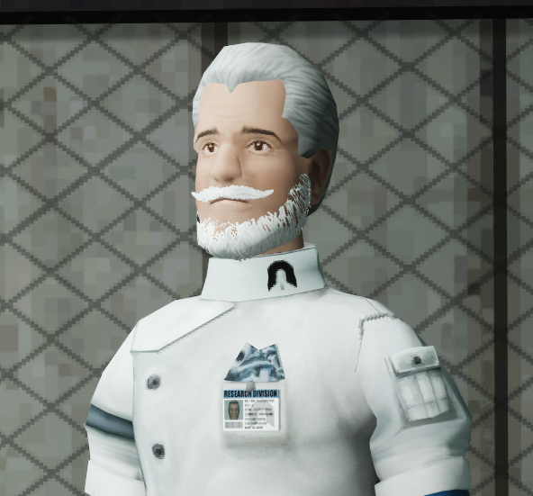

Abiotic Factor 한국어 패치
=============

  

안녕하십니까! 연구원 여러분!  
여러분들의 원활한 연구 활동을 위해 Abiotic Factor의 비공식 한국어 패치를 배포하오니, 아래 절차에 따라 설치하여 표본 연구에 도움을 주시길 바랍니다.  

 

## 1. 적용 방법
1. 우측 Releases에서 버전을 클릭  
    - 일반적인 경우, 아래 사진과 상관없이 가장 최신 걸로 선택하면 됩니다.  

    
2. 'zip'로 끝나는 파일을 선택하여 다운로드  
    
3. 압축 파일을 해제합니다.  
4. 압축 파일을 풀어서 나온 폴더 안에 있는 'AbioticFactor' 폴더를 복사합니다.
5. 스팀 라이브러리에서 Abiotic Factor를 찾아서 우클릭 > 관리 > 로컬 파일 탐색을 누릅니다.  
    
6. 방금 열린 폴더에 복사한 폴더를 붙여넣습니다. 이름이 같은 파일이 있다고 떠야 정상이며, 덮어쓰기를 선택합니다.  
7. 게임을 실행해서 설정 > 접근성에 들어가 언어를 한국어로 변경합니다.  
    
8. (선택 사항) 게임을 한 번 재시작합니다. 하지 않아도 되지만 몇몇 텍스트가 번역이 안 된 채로 남아 있을 수 있습니다.  

 

## 2. 적용 이미지
  

  

 

## 3. 버전 대응표
|게임 버전|한국어 패치 버전|배포 일자|비고|
|:---:|:---:|:---:|:---:|
|1.1.0.22148|1.6.0|2025-09-30|1.1.0.22148 임시 대응|
|1.0.0.21184|1.5.2|2025-09-30|1.0.0.21184 대응|
|1.0.0.21035|1.5.1|2025-09-28|일부 출력 문제 해결, 이미지 번역 추가, 이슈 수정 등|
|1.0.0.21035|1.5.0|2025-09-26|1.0 패치|
|1.0.0.20184|1.4.0|2025-07-30|임시 1.0 패치|
|0.10.0.15580|1.3.0|2025-03-07|암흑 에너지 업데이트 번역 완료|
|0.9.3.13099|1.2.1|2024-12-14|크리스마스 업데이트 번역 완료|
|0.9.3.13049|1.2.0|2024-12-08|임시 한국어 패치|
|0.9.2.12333|1.1.3|2024-10-26|0.9.2.12333 HOTFIX 대응|  
|0.9.2.12106|1.1.2|2024-10-14|대사가 나오지 않는 문제 해결|  
|0.9.2.12106|1.1.1|2024-10-14|할로윈 업데이트 번역 완료|  
|0.9.2|1.1.0|2024-10-10|임시 패치. 업데이트 내용은 번역되어 있지 않음.|  
|0.9.1.11753|1.0.1|2024-10-04||  
|0.9.1.11753|1.0.0|2024-10-03||  

 

## 4. 문의
 - 패치에 문제가 있을 경우, 아래 디스코드에서 제보해주세요!
 - https://discord.gg/B39kg26XFf  

 

## 5. 기여자 목록
 - Dr. 하늘빛 하늘
    - 번역 담당  
      
 - Dr. 볼펜촉
    - 번역 담당  
      
 - Dr. yeshjho
    - 기술 담당  
      
 - Dr. 시에스타
    - 이미지 담당  
      
